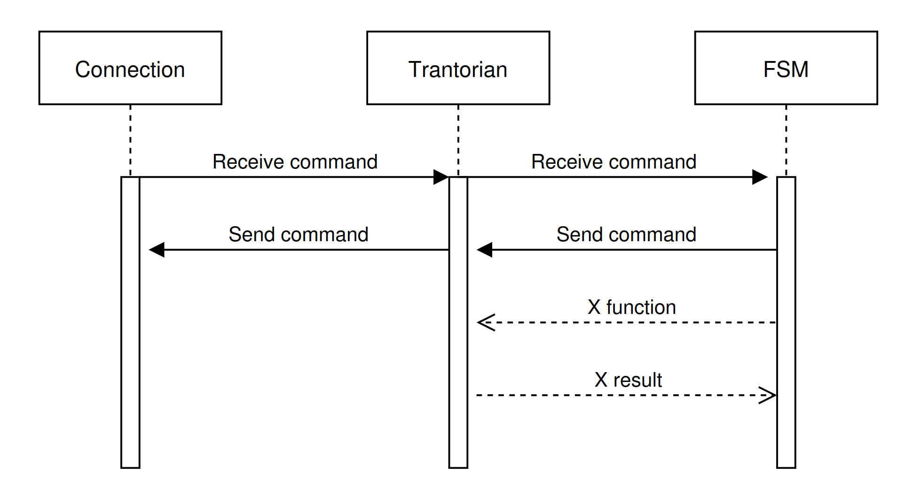

# Client Architecture

## With the aim to explain how a Trantorian is working, read the question and their answer.


### 1. How to connect with the server ?
### 2. How to run a behaviour
### 3. How to links connection and behaviour


---

## 1. Connection with the server


#### The connection to the server is established and maintained by a dedicated Connection class utilizing network sockets configured for a specific host and port. This system is designed to be asynchronous and robust, relying on the following components:  
- Handshake Protocol: Upon successful socket connection, the client waits to receive a "WELCOME" message from the server. Following this, it sends the designated team name and waits to receive the client number and the map dimensions to finalize the handshake. 
- Multi-threading Architecture: The connection relies on threads to prevent blocking operations. One thread is entirely dedicated to continuously reading incoming data from the socket, while another thread is responsible for polling and sending queued commands.  
- Queue Management: As server messages are received, they are parsed and separated into specific queues based on their type, such as broadcasts, server events (e.g., ejections, deaths, elevations), or standard command responses.  
- Command Buffering: The client manages outgoing requests using a command queue, limiting the number of active, pending requests sent to the server to a maximum of 10 at any given time.

### Here is the Connection run method:
```python
    def start(self):
        self.running = True
        self.reader_thread = threading.Thread(
            target=self.run_reader, daemon=False, name="Connection-Reader"
        )
        self.reader_thread.start()
        self.event_thread = threading.Thread(
            target=self.run_receive_poll_cmd, daemon=False, name="Connection-Receive"
        )
        self.event_thread.start()
```

---

## 2. Behaviour(s)

#### The artificial intelligence of a Trantorian is driven by a FiniteStateMachine (FSM), which continuously loops to evaluate the agent's situation and select the most appropriate state. 
- Routine Updates: The FSM manages game ticks and automatically dispatches essential maintenance commands, specifically "Inventory" and "Look", to keep the internal state synchronized with the server. 
- Immediate Reactions: During its execution loop, the FSM actively processes incoming broadcast messages and will immediately take food if it detects it on the current tile, prior to executing other state actions. 
- State Evaluation and Transitions: The FSM dynamically assigns the Trantorian's current state by evaluating its inventory and level.  
- Survival: If the Trantorian's food reserves drop below the predefined survival threshold, the system forces a transition into the SurviveState. 
- Evolution: If the Trantorian has gathered enough specific resources required to advance to the next level, it transitions into the EvolveState.  
- Gathering and End-Game: If the Trantorian does not have enough resources for the next level, it defaults to the GatherState. Once the Trantorian reaches the maximum level of 8, it shifts into the HelpTeamMatesState.


#### Here is a version of our FiniteStateMachine:
```python
class FiniteStateMachine:
    def __init__(self, default_state: AState, trantorian, tick_manager: TickManager):
        self.state = default_state
        self.trantorian = trantorian
        self.tick_manager = tick_manager
        self.sender = []
        self.pending_commands = {}

    def run(self):
        self.trantorian.logger.warning("===========Start FSM process===========")
        while True:
            meta_cmds = self.tick_manager.tick_update()
            self.send_auto_cmds(meta_cmds)
            self.process_broadcasts()
            self.process_pending_commands()
            self.eat_current_tile_food()
            self.update_state()
            self.execute_state()
            time.sleep(0.01)
```


---

## 3. Bring parts together

#### The Trantorian class serves as the vital link between the low-level Connection mechanics and the high-level decision-making of the FiniteStateMachine.  
- Centralized State: The Trantorian object initializes and encapsulates the active Connection, the PlayerState (which tracks inventory and vision), and the utilities required to parse and format network commands.  
- Action Abstraction: The class provides concrete, high-level methods (such as forward, take_object, and start_incantation) that the FSM can safely call. These methods abstract the network layer by sending the proper string commands to the Connection queue and optionally waiting for the server's success or failure response.  
- Asynchronous Event Handling: While the Trantorian class provides the tools, the FSM actively polls it to bridge the gap. The FSM checks the Connection queues for pending command responses and server events. If the FSM detects an ejection or an elevation event, it automatically reacts by queuing a new "Look" command via the Trantorian class to refresh the agent's spatial awareness.  

Here is a version of the trantorian class
```python
class Trantorian:
    def __init__(self, port, host, team_name, player_id):
        self.thread = threading.Lock()
        self.answer_list = []
        self.data_lock = threading.Lock()
        self.team_name = team_name
        self.player_id = player_id
        self.connection = Connection(host, port, team_name)
        self.player_state = PlayerState(team_name)
        self.send_command = SendCommand(self.connection)
        self.parser = ParseCommand(self.player_state.inventory)
        self.logger = logging.getLogger(f"player_{player_id}")
        self.broadcast_manager = BroadcastMessageManager(
            self.player_state, self.player_id
        )
        self.received_broadcasts = []

```

### 4. Visual archi

