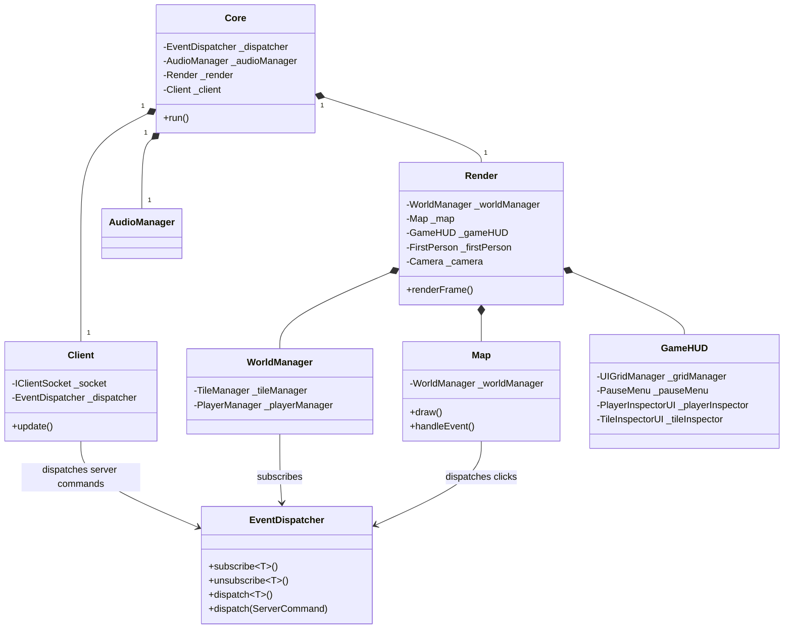

# High-Level Architecture

The GUI uses an event-driven architecture. The network client parses text messages into typed protocol commands, then dispatches them through `EventDispatcher`. Scene managers subscribe to the commands they own and update local render state.

This keeps the GUI modular:

* `network::Client` knows about sockets and protocol parsing, but not about rendering.
* `WorldManager` knows about server commands and scene state, but not about the window.
* `Render` owns the window, camera, map renderer, HUD, and update mode.
* UI panels communicate through typed GUI events or through explicit callbacks.
* `AudioManager` is shared by render, world, and UI systems for music and sound effects.

## System Diagram

## Data Flow

1. The server sends a line such as `pnw #1 2 3 1 1 team`.
2. `Client::update()` pops the message from the socket.
3. `shared::protocol::Parser::parseServerCommand()` converts it into a typed command variant.
4. `EventDispatcher::dispatch(const ServerCommand&)` dispatches the concrete type.
5. `WorldManager` routes the command to `PlayerManager` or `TileManager`.
6. The manager updates local state.
7. `Render::renderFrame()` draws the latest state.
8. UI and audio systems react to either the same command or derived GUI events.

## Ownership Rules

The GUI deliberately avoids global mutable world state.

* `Core` owns the long-lived dispatcher, audio manager, render system, and network client.
* `Render` owns scene systems that need the camera or window.
* `WorldManager` owns `TileManager` and `PlayerManager` through `std::unique_ptr`.
* `PlayerManager` stores teams, players, eggs, and active incantations.
* `TileManager` stores tiles and tile resources.
* `UIManager` stores shared UI components and updates them in draw/event order.

When adding a new feature, first ask: "Who owns the state?" Most server-driven world state belongs in `TileManager` or `PlayerManager`; most visual interaction state belongs in `Render`, `Map`, or a UI panel.

