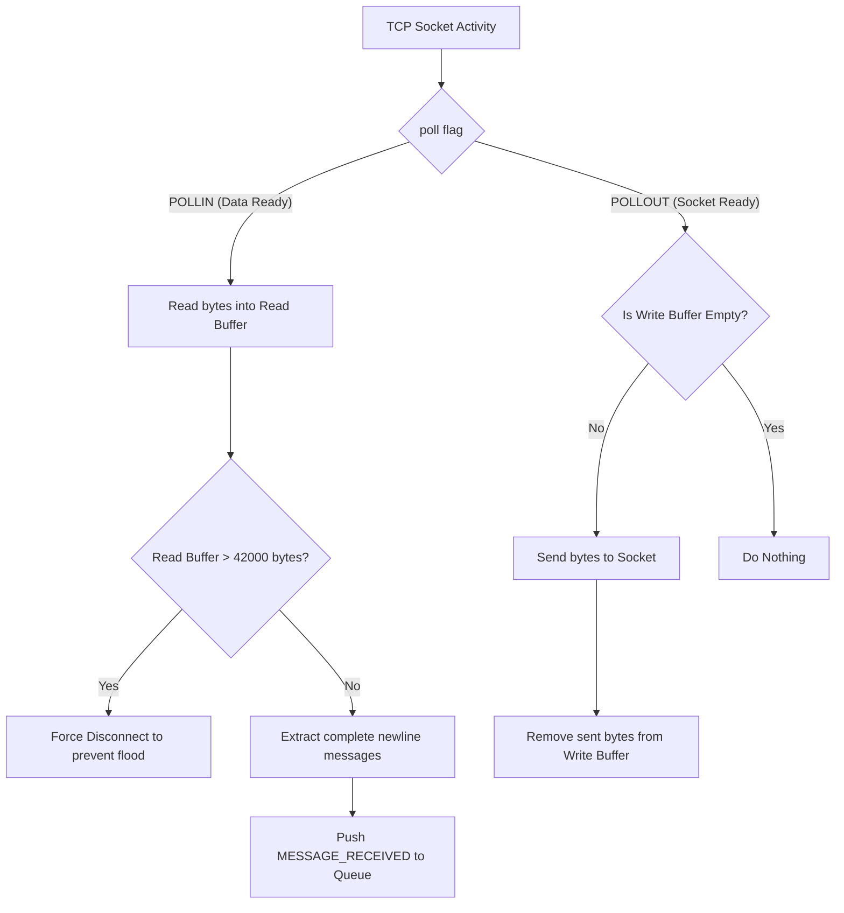

# The Network Layer

The networking layer of the Zappy server is encapsulated within the `SessionManager`. Its primary responsibility is to handle all TCP socket communications asynchronously, ensuring that the game engine is never blocked by slow clients or network latency.

## Non-Blocking I/O and `poll()`

Because the server must operate on a single thread, it uses the POSIX `poll()` system call to monitor multiple file descriptors simultaneously. 

* **The Server Socket:** Listens for incoming TCP connections. When `poll()` flags this socket as `POLLIN`, the server accepts the connection, wraps it in a `ClientSocket`, and adds it to the monitoring list.
* **Client Sockets:** Monitored for both reading (`POLLIN`) and writing (`POLLOUT`). 

The `pollNetwork(int timeout)` function is driven entirely by the game clock. If the server is idle, it blocks until a network event occurs. If a game tick is approaching, the timeout is calculated dynamically so the network polling never oversteps the game frequency.

## Buffer Management and Security

To prevent memory exhaustion and buffer overflow attacks from malicious or buggy clients, the `SessionManager` implements strict buffer management:

1.  **Read Buffers:** Incoming bytes are appended to a client-specific `std::string` buffer. If a client's read buffer exceeds **42000 bytes** (enough to send the whole maximum map size data), the server instantly throws a `SocketError` and forcefully disconnects the client.
2.  **Message Extraction:** The server does not pass raw, fragmented bytes to the game engine. The `extractCompleteMessages` function continuously scans the read buffer for the newline character (`\n`). Once found, it extracts the complete command and pushes it to the event queue.
3.  **Write Buffers:** Outgoing messages from the game engine are queued in a write buffer. During the polling phase, if a socket is ready for writing, the server flushes as much data as the TCP window allows.

## The Event Queue

The `SessionManager` communicates with the main server loop via an internal `_eventQueue`. It translates raw socket activity into actionable `NetworkEvent` objects:

* `CLIENT_CONNECTED`
* `CLIENT_DISCONNECTED`
* `MESSAGE_RECEIVED`

This queue creates a perfect abstraction barrier. The rest of the server never interacts with file descriptors; it only processes events.

## Asynchronous Writing (`POLLOUT`)

In a single-threaded architecture, writing directly to a socket is dangerous; if the client has a slow connection, the `send()` system call will block the entire server. The `SessionManager` solves this using Write Buffers.

1. **Queuing Messages:** When the `Core` calls `sendMessage()`, the data is not sent immediately. It is safely appended to the client's `_writeBuffer`.
2. **The Write Event:** During the `poll()` phase, the server monitors all client sockets for the `POLLOUT` flag, which indicates the OS TCP window has available space.
3. **Flushing:** If `POLLOUT` is triggered and the client's write buffer is not empty, the `SessionManager` performs a non-blocking `send()`. Any bytes that cannot be sent immediately remain in the buffer for the next polling cycle.

## System Diagram

The following diagram illustrates the flow of data through the `SessionManager`:

