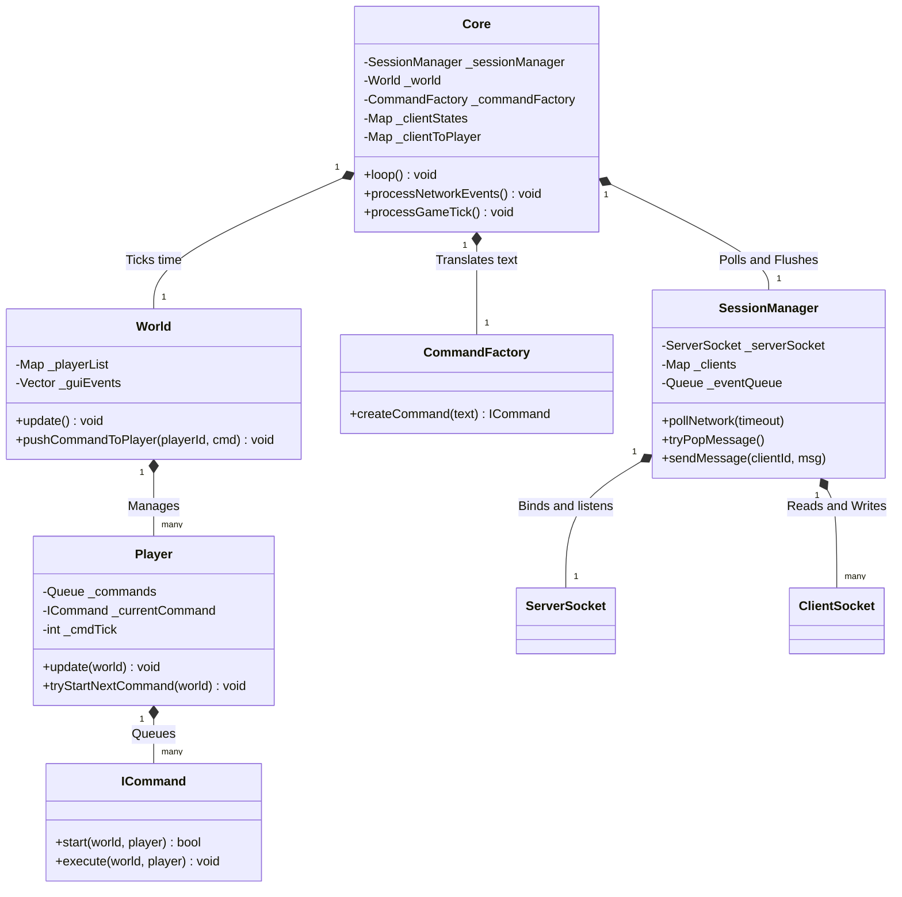

# High-Level Architecture

The Zappy server is built using a hybrid of the **Reactor Pattern** for networking and a **Discrete-Time Game Loop** for simulation. 

Because the server must remain strictly single-threaded without dropping network inputs or lagging the game clock, the architecture aggressively separates the unpredictable nature of TCP networking from the deterministic nature of the game rules.

## Core Design Philosophy

1.  **Isolation of Concerns:** The network layer (`SessionManager`) knows nothing about the game (players, tiles, food). The game engine (`World`) knows nothing about file descriptors or sockets.
2.  **The Middleman:** The `Core` acts as the orchestrator. It maps network IDs to player IDs, translates raw strings into executable commands, and dictates when time moves forward.
3.  **Asynchronous Command Queuing:** Client commands are instantly parsed and pushed to a player's internal queue. They are only executed when the required number of game ticks has elapsed.

## System Diagram

The following diagram illustrates the structural relationships between the major components.

