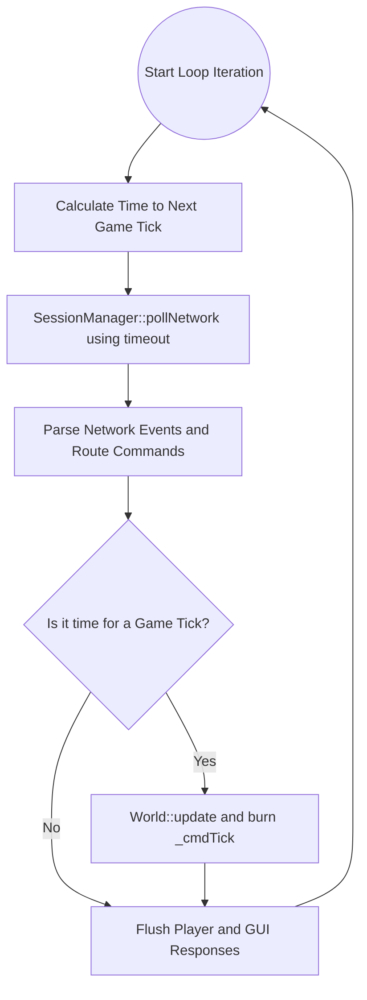

# The Core Orchestrator

The `Core` class is the central nervous system of the Zappy server. It acts as the bridge between the asynchronous network layer and the strict, deterministic clock of the game engine. 

## The Main Loop Lifecycle

The `Core::loop()` executes hundreds of times per second, strictly adhering to the following phased lifecycle:

1.  **Calculate Timeout:** The core checks the real-world system clock (`std::chrono`) against the next scheduled game tick.
2.  **Poll Network:** `SessionManager::pollNetwork()` is called. It uses the calculated timeout to wait for network traffic without accidentally skipping the game tick.
3.  **Process Network Events:** Network events are popped from the queue. Text commands are parsed and routed to the appropriate players.
4.  **Process Game Tick:** If enough real-world time has passed to constitute a "tick" (based on the `freq` parameter), `World::update()` is called. 
5.  **Flush Responses:** Any messages generated during the network parsing or the game tick are immediately flushed to the TCP write buffers.

*Note: The flush functions execute continuously on every loop iteration, even if the game engine did not tick. This guarantees that GUI events (like `pfk` or `pnw`) are transmitted instantly.*

## Client State Routing

When a client connects, the `SessionManager` only knows their integer ID (the file descriptor). `Core` manages the identity of these clients using a state machine (`_clientStates`):

* **`WAITING_TEAM_SELECTION`:** The client has just connected and received `WELCOME\n`. The server is waiting for them to send a team name.
* **`GUI`:** The client sent `GRAPHIC`. They are locked into the spectator role and will receive all global game events (map size, time unit, tile updates).
* **`IN_GAME`:** The client sent a valid team name. `Core` maps their network ID to a specific Player ID in the `World` (`_clientToPlayer`). All subsequent messages from this client are routed directly to their avatar.

## Command Translation

To keep the game engine clean, the `World` does not parse text. `Core` utilizes a `CommandFactory` to translate raw strings (e.g., `"Forward\n"`) into polymorphic `std::unique_ptr<ICommand>` objects.

**Zero-Tick Failures:** If a client sends an invalid or unknown command, the factory returns a generic `Unknown` command object. This ensures that malformed commands still enter the player's queue and wait their chronological turn before instantly failing and returning `ko\n`.

## System Diagram

The following diagram illustrates the flow of data through the `Core` orchestrator:

