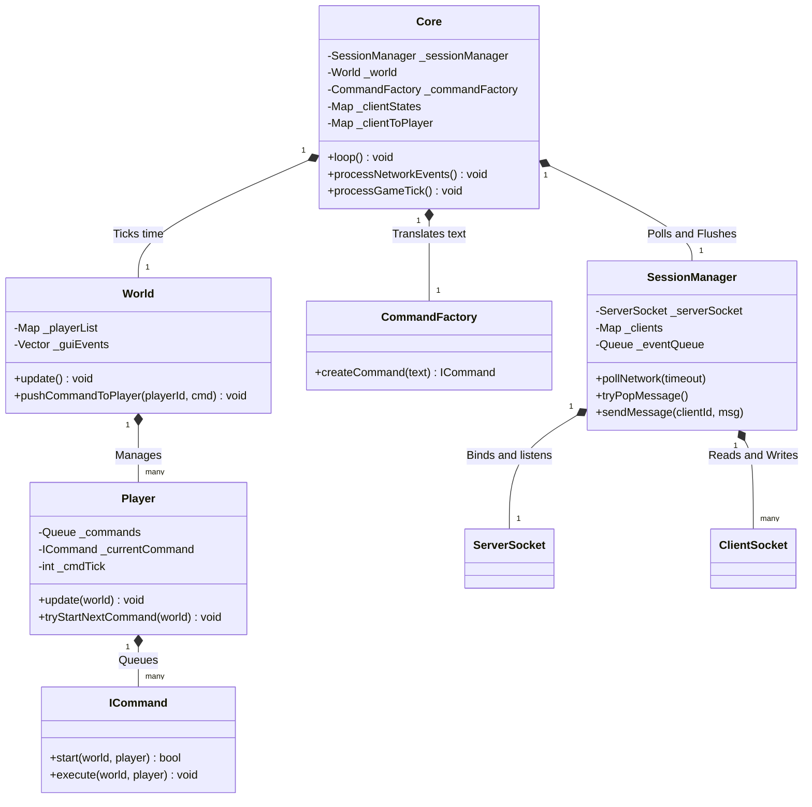

```mermaid
classDiagram
    class Core {
        -SessionManager _sessionManager
        -World _world
        -CommandFactory _commandFactory
        -Map _clientStates
        -Map _clientToPlayer
        +loop() void
        +processNetworkEvents() void
        +processGameTick() void
    }

    class SessionManager {
        -ServerSocket _serverSocket
        -Map _clients
        -Queue _eventQueue
        +pollNetwork(timeout)
        +tryPopMessage()
        +sendMessage(clientId, msg)
    }

    class CommandFactory {
        +createCommand(text) ICommand
    }

    class World {
        -Map _playerList
        -Vector _guiEvents
        +update() void
        +pushCommandToPlayer(playerId, cmd) void
    }

    class Player {
        -Queue _commands
        -ICommand _currentCommand
        -int _cmdTick
        +update(world) void
        +tryStartNextCommand(world) void
    }

    class ICommand {
        +start(world, player) bool
        +execute(world, player) void
    }

    class ServerSocket
    class ClientSocket

    Core "1" *-- "1" SessionManager : Polls and Flushes
    Core "1" *-- "1" World : Ticks time
    Core "1" *-- "1" CommandFactory : Translates text
    SessionManager "1" *-- "1" ServerSocket : Binds and listens
    SessionManager "1" *-- "many" ClientSocket : Reads and Writes
    World "1" *-- "many" Player : Manages
    Player "1" *-- "many" ICommand : Queues
```
